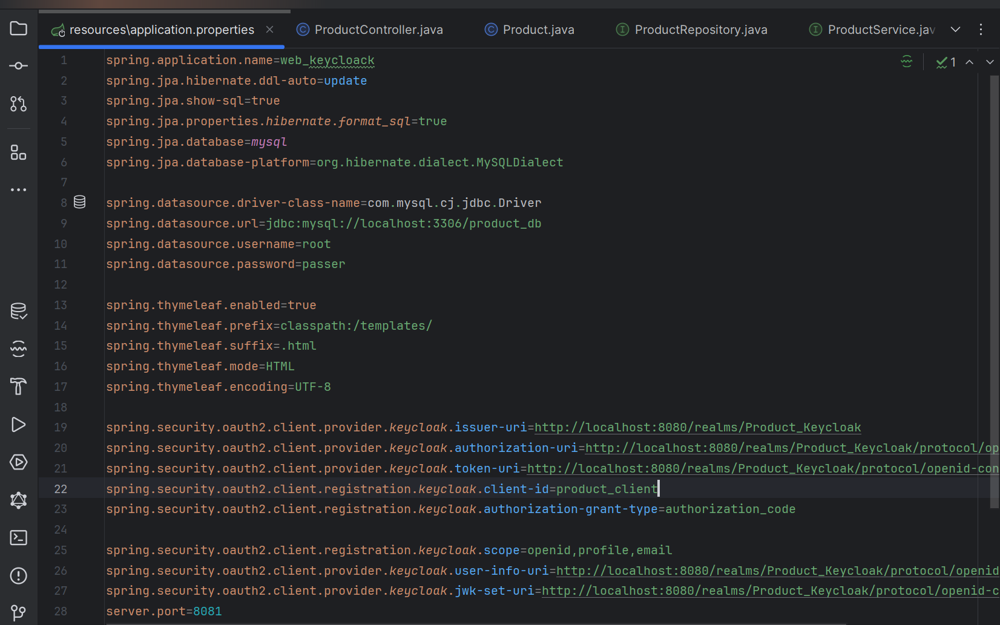
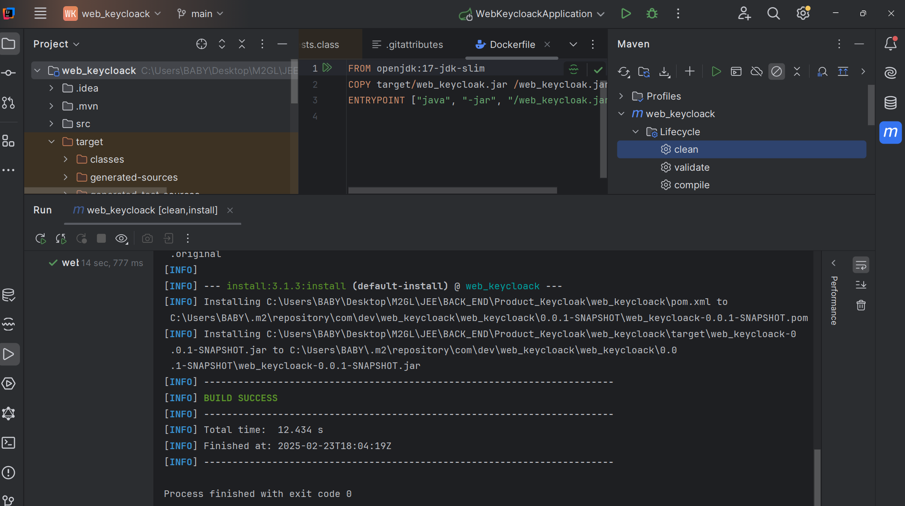
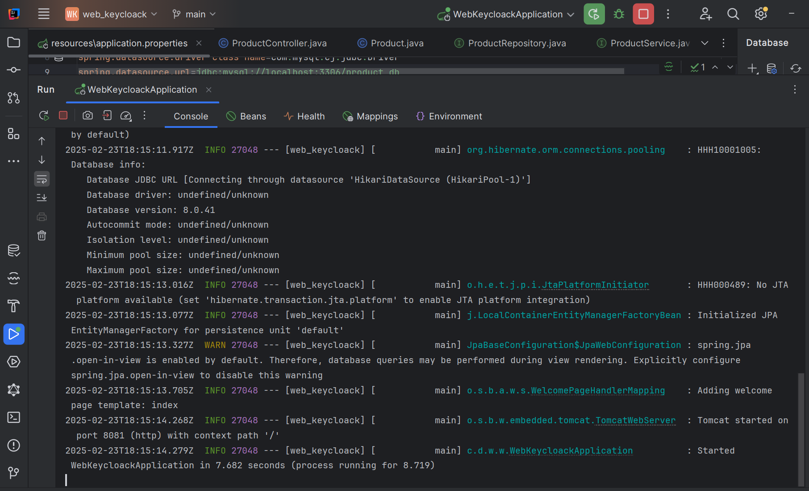
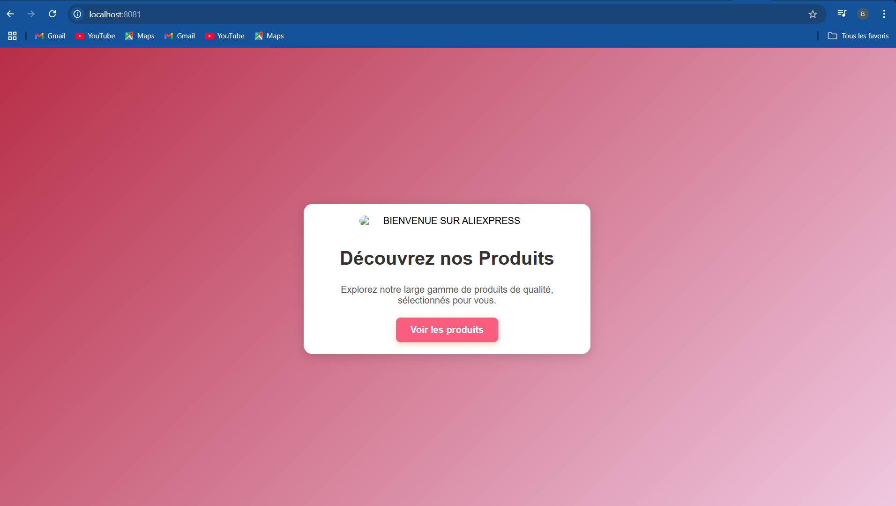
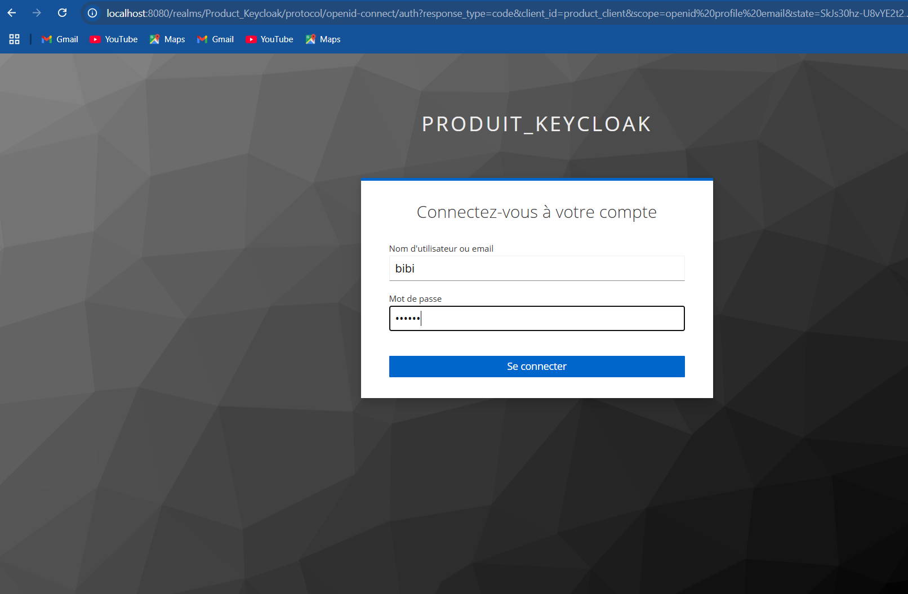
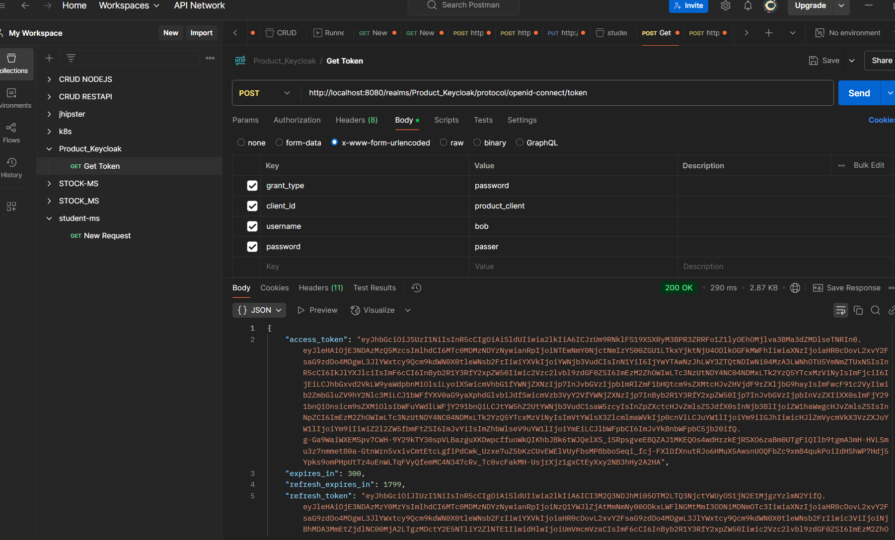
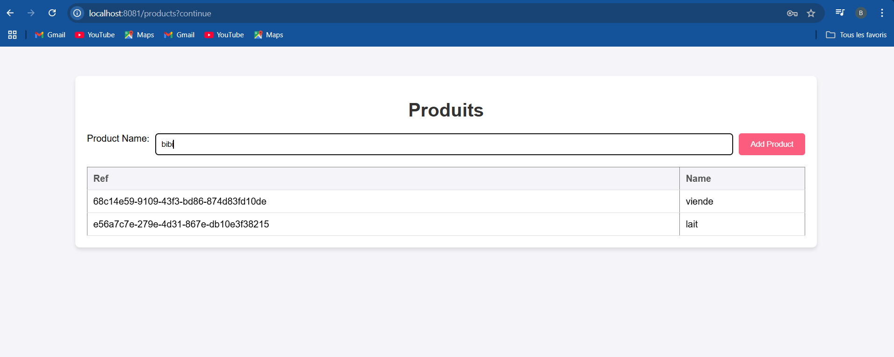
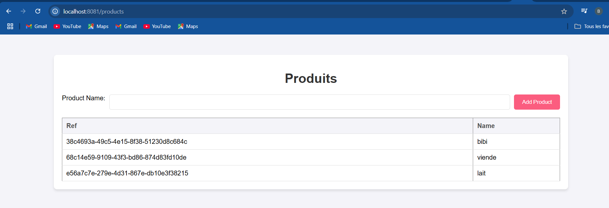
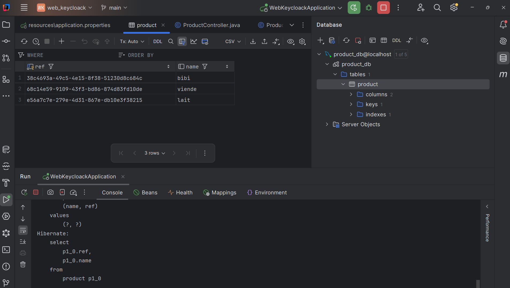

# 1️⃣ Prérequis
Avant de commencer, assurez-vous d'avoir installé :

```bash
- Java 17+
- Maven 3.9
```
📦 Application de gestion de produits

📌 Fonctionnalités 

    -Ajouter un produit (référence et nom)
    -Afficher la liste des produits
    -Authentification et autorisation via Keycloak

🚀 Installation et configuration

## 2️⃣ Construire le projet

1- Lancez Keycloak (Docker recommandé) :

```bash
docker run -d -p 8080:8080 --name keycloak \
-e KEYCLOAK_ADMIN=admin -e KEYCLOAK_ADMIN_PASSWORD=admin \
quay.io/keycloak/keycloak:22.0 start-dev
```

2-Keycloak:

    -Se connecter à Keycloak Admin via http://localhost:8080/admin
    -Créer un Realm 
    -Ajouter un Client 
    -Créer un Utilisateur 

## Building

➤ Configuration de keycloak :



💡 Builder l'application :
```bash
mvn clean install
```




➤ Lancer l'application' :



➤ Execution de l'application :http://localhost:8081



➤ Authentification avec KEYCLOAK  :


➤ Token d'authentification  :


➤ Accès à l'application  : 




➤ Base de donnees de l'application  :


